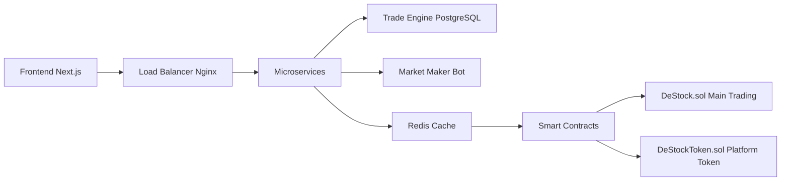

# DeStock - Decentralized Trading Platform for Tokenized Shares🚀

<div align="center">

[](https://getfoundry.sh/)
[](https://nextjs.org/)
[](https://www.docker.com/)
[](https://www.typescriptlang.org/)

</div>

<div align="center">
  <h3>🌟 A comprehensive DeFi trading platform with AMM, order books, liquidity provision, and real-time microservices architecture 🌟</h3>
</div>

---

## 📋 Table of Contents

- [🌟 Overview](#-overview)
- [🏗️ Architecture](#️-architecture)
- [📁 Project Structure](#-project-structure)
- [🚀 Quick Start](#-quick-start)
- [✨ Key Features](#-key-features)
- [🔧 Development](#-development)
- [🧪 Testing](#-testing)
- [📊 Tech Stack](#-tech-stack)
- [🤝 Contributing](#-contributing)
- [📄 License](#-license)
- [🙏 Acknowledgments](#-acknowledgments)

---

## 🌟 Overview

DeStock is a **professional-grade decentralized trading platform** that enables trading of tokenized company shares using DSTK tokens. It combines automated market making (AMM), traditional order books, and liquidity provider rewards in a single platform.

<div align="center">
  
</div>

---

## 🏗️ Architecture



<details>
<summary>📐 Architecture Diagram (Text)</summary>

```
Frontend (Next.js) ──► Load Balancer (Nginx) ──► Microservices
                                                  ├── Trade Engine (PostgreSQL)
                                                  ├── Market Maker Bot
                                                  └── Redis Cache
                                                        │
Smart Contracts ◄─────────────────────────────────────┘
├── DeStock.sol (Main Trading)                        │
└── DeStockToken.sol (Platform Token) ◄───────────────┘
```

</details>

---

## 📁 Project Structure

```
DeStock/
├── 📱 apps/web/                    # Next.js Trading Interface
├── 🔗 contracts/                  # Smart Contracts & Tests
│   ├── src/                      # Solidity contracts
│   ├── test/                     # Contract tests
│   └── script/                   # Deployment scripts
├── 🐳 services/                   # Microservices
│   ├── trade-engine/             # Order matching engine
│   └── market-maker/             # Automated trading bot
├── 🏗️ infrastructure/             # Docker & Config
│   ├── docker-compose.yml        # Service orchestration
│   └── nginx.conf                # Load balancer
├── 📜 scripts/                    # Automation scripts
├── 📚 docs/                       # Documentation
└── 🎨 assets/                     # Static assets
```

---

## 🚀 Quick Start

### Prerequisites

<div align="center">

| Requirement | Version | Installation |
|-------------|---------|-------------|
| 🐳 Docker Desktop | Latest | [Download](https://www.docker.com/products/docker-desktop/) |
| 🟢 Node.js | 18+ | [Download](https://nodejs.org/) |
| ⚡ Foundry | Latest | `curl -L https://foundry.paradigm.xyz \| bash` |

</div>

### One-Command Launch

```bash
# Clone and start the platform
git clone https://github.com/shri29s/DeStock.git
cd DeStock
chmod +x scripts/start-destock.sh
./scripts/start-destock.sh
```

### 🌐 Access the Platform

<div align="center">

| Service | URL | Description |
|---------|-----|-------------|
| **🎯 Trading Platform** | http://localhost:3000 | Main trading interface |
| **🔧 API Gateway** | http://localhost:80 | Load balancer |
| **⛓️ Blockchain RPC** | http://localhost:8545 | Local blockchain |

</div>

---

## ✨ Key Features

### 🔗 Smart Contract Features

<table>
<tr>
<td width="50%">

**🤖 AMM Trading**
- Automated market making with dynamic pricing
- Liquidity pools with yield farming

**📊 Order Book**
- Traditional limit orders with matching engine
- Real-time order management

</td>
<td width="50%">

**🪙 LP Tokens**
- Liquidity provider rewards system
- Staking mechanisms

**🏢 Company Tokenization**
- Create and trade company shares
- Governance token integration

</td>
</tr>
</table>

**💰 Trading Fees**: 0.25% fee structure for platform sustainability

### 📈 Trading Interface

<div align="center">

| Feature | Description |
|---------|-------------|
| 📋 **Real-time Order Book** | Live bid/ask spreads |
| 📊 **Professional Charts** | Candlestick charts with timeframes |
| 💼 **Portfolio Dashboard** | Holdings and P&L tracking |
| 🗺️ **Market Heatmap** | Visual market overview |
| ⚡ **Instant Trading** | Market and limit orders |

</div>

### 🛠️ Microservices

- **🔄 Trade Engine**: Real-time order matching with PostgreSQL
- **🤖 Market Maker**: Automated liquidity provision
- **📡 WebSocket Streaming**: Live price feeds and order updates
- **⚖️ Load Balancer**: High-availability architecture

---

## 🔧 Development

### Smart Contracts

```bash
# 🏗️ Contract Development
npm run contracts:build    # Compile contracts
npm run contracts:test     # Run tests  
npm run contracts:deploy   # Deploy to local chain
```

### Frontend

```bash
# 🎨 Frontend Development
npm run web:dev           # Start development server
npm run web:build         # Build for production
```

### Platform Management

```bash
# 🚀 Platform Operations
npm run platform:start   # Start entire platform
npm run platform:stop    # Stop all services
```

---

## 🧪 Testing

### Smart Contract Tests

```bash
# 🔍 Contract Testing
cd contracts && forge test -vv
```

### Service Health Checks

```bash
# 🏥 Health Monitoring
curl http://localhost:3002/api/health  # Trade Engine
curl http://localhost:3001/api/health  # Market Maker
```

---

## 📊 Tech Stack

<div align="center">

### Blockchain Layer


### Frontend


### Backend


### Infrastructure


</div>

---

## 🤝 Contributing

We welcome contributions! Please follow these steps:

1. **🍴 Fork the repository**
2. **🌿 Create your feature branch**: `git checkout -b feature/amazing-feature`
3. **💾 Commit your changes**: `git commit -m 'Add amazing feature'`
4. **🚀 Push to the branch**: `git push origin feature/amazing-feature`
5. **📬 Open a Pull Request**

<div align="center">
  <a href="https://github.com/shri29s/DeStock/issues">
    
  </a>
  <a href="https://github.com/shri29s/DeStock/pulls">
    
  </a>
</div>

---

## 📄 License

This project is licensed under the MIT License - see the [LICENSE](LICENSE) file for details.

---

## 🙏 Acknowledgments

Special thanks to these amazing projects that made DeStock possible:

- [**Foundry**](https://getfoundry.sh/) - Smart contract development toolkit
- [**Next.js**](https://nextjs.org/) - The React framework for production
- [**OpenZeppelin**](https://openzeppelin.com/) - Secure smart contract development

---

<div align="center">
  <h3>Built with ❤️ for the future of decentralized finance</h3>
  
  <p>
    <a href="https://github.com/shri29s/DeStock">⭐ Star this repository</a> if you find it helpful!
  </p>
  
  
  
</div>