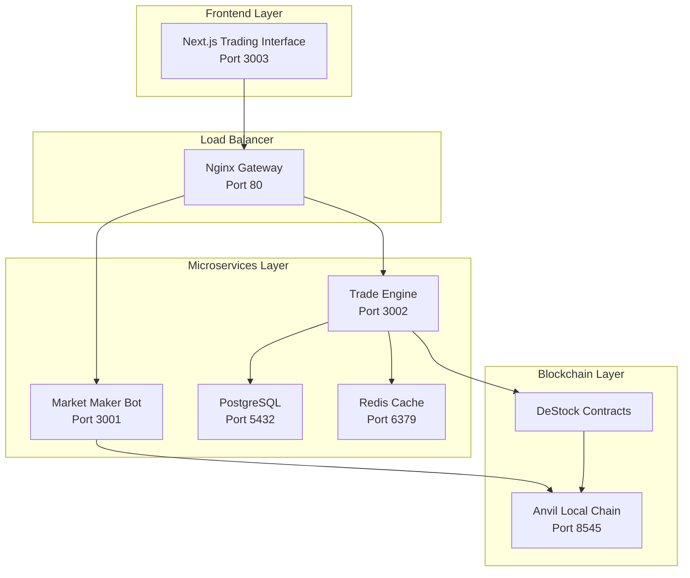

# DeStock - Professional Decentralized Trading Platform 🚀

> **An institutional-grade Web3 trading platform with LP tokens, order book management, automated market making, and real-time microservices architecture.**

[](https://getfoundry.sh/)
[](https://nextjs.org/)
[](https://www.docker.com/)
[](https://www.typescriptlang.org/)

## 🌟 Overview

DeStock is a sophisticated decentralized trading platform that combines cutting-edge DeFi protocols with professional trading tools. Built with a microservices architecture, it offers LP token functionality, real-time order books, automated market making, and institutional-grade trading features.

## 🏗️ Complete System Architecture



## 📁 Project Structure

```
DeStock/
├── 🌐 Frontend Layer
│   └── apps/web/                   # Next.js 15 Trading Interface
│       ├── app/                   # App Router & API Routes
│       ├── components/            # Trading Components
│       │   ├── trading/           # OrderBook, DepthChart, TradingForm
│       │   ├── MarketHeatMap.tsx  # Market Visualization
│       │   └── ConnectWallet.tsx  # Web3 Integration
│       └── lib/                   # Hooks, Utils, Contracts
│
├── 🐳 Microservices Layer
│   ├── services/
│   │   ├── trade-engine/          # Order Management Service
│   │   │   ├── index.js          # WebSocket + REST API
│   │   │   ├── abi/              # Contract ABIs
│   │   │   └── Dockerfile        # Container Config
│   │   └── market-maker/          # Automated Trading Bot
│   │       ├── index.js          # Market Making Logic
│   │       └── Dockerfile        # Container Config
│   ├── docker-compose.yml        # Service Orchestration
│   ├── nginx.conf                # Load Balancer Config
│   └── init.sql                  # Database Schema
│
├── ⛓️ Blockchain Layer
│   ├── src/                      # Smart Contracts
│   │   ├── DeStock.sol          # Main Trading Contract
│   │   └── DeStockToken.sol     # Platform Token
│   ├── script/Deploy.s.sol      # Deployment Script
│   ├── test/                    # Contract Tests
│   └── foundry.toml             # Foundry Config
│
└── 🔧 Configuration
    ├── .env                     # Environment Variables
    ├── start-destock.sh         # Startup Script
    └── README.md               # This file
```

## 🚀 Complete Setup Guide

### 📋 Prerequisites

```bash
# Required tools
- Docker Desktop (running)
- Node.js 18+ 
- Foundry
- Git

# Install Foundry
curl -L https://foundry.paradigm.xyz | bash
foundryup

# Verify installations
forge --version
anvil --version
docker --version
node --version
```

### 🏁 One-Command Startup

```bash
# Clone and setup
git clone https://github.com/shri29s/DeStock.git
cd DeStock

# Make startup script executable
chmod +x start-destock.sh

# Start entire platform
./start-destock.sh
```

**✨ What the startup script does:**
- 🔍 **Smart Detection**: Checks if Anvil is already running
- ⛓️ **Auto Blockchain**: Starts Anvil if needed with proper configuration
- 🔨 **Contract Pipeline**: Compiles, tests, and deploys smart contracts
- 📄 **Address Updates**: Automatically updates .env with new contract addresses
- 🐳 **Docker Services**: Starts all microservices with health checks
- 🌐 **Frontend Launch**: Starts Next.js development server
- 🏥 **Health Monitoring**: Verifies all services are running correctly
- 📊 **Status Dashboard**: Shows all service URLs and management commands

**🎯 Expected successful output:**
```
🎉 DeStock Trading Platform is now running!
==================================================
📱 Frontend:      http://localhost:3003
🔗 Blockchain:    http://localhost:8545
🐳 Load Balancer: http://localhost:80
⚙️  Trade Engine:  http://localhost:3002
🤖 Market Maker:  http://localhost:3001
🗄️  Database:     localhost:5432
💾 Redis Cache:   localhost:6379
```

### 📝 Manual Setup (Step by Step)

#### 1️⃣ Start Local Blockchain

```bash
# Terminal 1 - Start Anvil blockchain
anvil --host 0.0.0.0 --port 8545 --chain-id 31337
```

**Keep this running!** Provides:
- Local Ethereum node: `http://localhost:8545`
- 10 pre-funded accounts
- Instant mining for testing

#### 2️⃣ Deploy Smart Contracts

```bash
# Terminal 2 - Deploy contracts
cd DeStock

# Compile contracts
forge build

# Run tests
forge test -vv

# Deploy to local chain
forge script script/Deploy.s.sol:Deploy \
  --rpc-url http://localhost:8545 \
  --private-key 0xac0974bec39a17e36ba4a6b4d238ff944bacb478cbed5efcae784d7bf4f2ff80 \
  --broadcast
```

#### 3️⃣ Start Microservices

```bash
# Terminal 3 - Start Docker services
docker-compose down
docker-compose build --no-cache
docker-compose up -d

# Verify all services running
docker-compose ps
```

#### 4️⃣ Start Frontend

```bash
# Terminal 4 - Start Next.js
cd apps/web
npm install
npm run dev
```

## 📊 Key Features

### 🏛️ Smart Contract Features

**Advanced DeFi Trading:**
- ✅ **LP Token System**: Add/remove liquidity with reward tokens
- ✅ **Order Book Trading**: Place, cancel, match orders with 0.25% fees
- ✅ **Company Tokenization**: Create tradeable company shares
- ✅ **Real-time Events**: Live blockchain event streaming
- ✅ **Fee Collection**: Platform sustainability through trading fees

**Contract Functions:**
```solidity
// Liquidity Management
addLiquidity(companyId, amount) → LP tokens
removeLiquidity(companyId, lpAmount) → underlying tokens

// Order Management
placeOrder(companyId, isBuy, amount, price) → order ID
cancelOrder(orderId) → cancellation
matchOrders() → automated matching

// Company Management
registerCompany(name, symbol, initialSupply) → company ID
getCompanyInfo(companyId) → complete company data
```

### 📈 Professional Trading Interface

**Real-time Trading Components:**
- 📊 **Live Order Book**: Real-time bid/ask spreads and market depth
- 📈 **Trading Charts**: Professional candlestick charts with timeframes
- 💹 **Price Tickers**: Live price feeds with 24h volume and changes
- 🎯 **Advanced Orders**: Market orders, limit orders, stop-loss
- 💰 **Portfolio Dashboard**: Holdings, P&L, performance analytics

**Market Analysis Tools:**
- 🔥 **Market Heatmap**: Visual market overview with color-coded performance
- 📋 **Company Explorer**: Browse and analyze tokenized companies
- 📊 **Trade History**: Complete transaction history and analytics
- 💎 **LP Management**: Liquidity provider dashboard and controls

### 🛠️ Microservices Architecture

**Trade Engine Service (Port 3002):**
```javascript
Features:
- Real-time order matching engine
- PostgreSQL persistence layer
- WebSocket streaming (Port 8080)
- RESTful API endpoints
- Blockchain event synchronization

API Endpoints:
- GET /api/health
- GET /api/orderbook/:companyId
- GET /api/trades/:companyId
- GET /api/price-history/:companyId
- POST /api/orders
```

**Market Maker Bot (Port 3001):**
```javascript
Features:
- Automated liquidity provision
- Configurable spread management (2% default)
- Multi-asset market making
- Real-time price updates

Controls:
- Start/stop market making
- Adjust spread parameters
- Monitor active orders
- Risk management
```

**Database Layer (PostgreSQL):**
```sql
Tables:
- orders (order_id, company_id, trader, amount, price, status)
- price_history (company_id, price, volume, timestamp)
- trade_history (trade_id, buy_order, sell_order, amount, price)
- liquidity_pools (company_id, token_reserve, share_reserve, lp_supply)
```

**Load Balancer (Nginx):**
- API gateway and request routing
- WebSocket proxy for real-time connections
- Load balancing across services
- Health monitoring and failover

## 🌐 Access URLs

### 🎮 User Interfaces
- **Trading Platform**: http://localhost:3003
- **API Gateway**: http://localhost:80

### 🔧 Microservices
- **Trade Engine**: http://localhost:3002
- **Market Maker**: http://localhost:3001
- **Database**: localhost:5432
- **Cache**: localhost:6379

### ⛓️ Blockchain
- **Anvil RPC**: http://localhost:8545
- **Chain ID**: 31337
- **WebSocket**: ws://localhost:8080

## 🧪 Testing & Verification

### Smart Contract Tests
```bash
# Run comprehensive test suite
forge test -vv

# Run specific test
forge test --match-test testLiquidityProvider

# Coverage report
forge coverage
```

### Service Health Checks
```bash
# Check all services
curl http://localhost:3002/api/health    # Trade Engine
curl http://localhost:3001/api/health    # Market Maker  
curl http://localhost:80/health          # Load Balancer

# Test API routing
curl http://localhost:80/api/trade/health
curl http://localhost:80/api/market-maker/health
```

### Integration Testing
```bash
# Test blockchain connectivity
cast call CONTRACT_ADDRESS "owner()" --rpc-url http://localhost:8545

# Test WebSocket connections
wscat -c ws://localhost:8080

# Test database connection
docker exec -it destock-postgres psql -U postgres -d destock
```

## 🛠️ Development Workflow

### Smart Contract Development
```bash
# Continuous testing during development
forge test -w

# Deploy with verification
forge script script/Deploy.s.sol:Deploy \
  --rpc-url $SEPOLIA_RPC_URL \
  --private-key $PRIVATE_KEY \
  --broadcast --verify

# Interact with deployed contracts
cast send CONTRACT_ADDRESS "functionName(params)" \
  --private-key $PRIVATE_KEY \
  --rpc-url http://localhost:8545
```

### Microservices Development
```bash
# View service logs
docker-compose logs -f trade-engine
docker-compose logs -f market-maker

# Restart specific service
docker-compose restart trade-engine

# Rebuild after code changes
docker-compose build trade-engine --no-cache
docker-compose up -d trade-engine
```

### Frontend Development
```bash
# Hot reload development
npm run dev

# Type checking
npm run type-check

# Build for production
npm run build
```

## 🔧 Configuration

### Environment Variables
```bash
# .env file configuration
DESTOCK_CONTRACT_ADDRESS=0xe7f1725E7734CE288F8367e1Bb143E90bb3F0512
PRIVATE_KEY=ac0974bec39a17e36ba4a6b4d238ff944bacb478cbed5efcae784d7bf4f2ff80
RPC_URL=http://localhost:8545
DB_HOST=postgres
DB_PORT=5432
DB_NAME=destock
DB_USER=postgres
DB_PASSWORD=password
REDIS_URL=redis://redis:6379
TRADING_FEE=0.25
```

### Docker Configuration
```yaml
# docker-compose.yml highlights
services:
  trade-engine:
    ports: ["3002:3002", "8080:8080"]
    environment: [DB_HOST, RPC_URL, DESTOCK_CONTRACT_ADDRESS]
  
  market-maker:
    ports: ["3001:3001", "8081:8081"]
    environment: [RPC_URL, PRIVATE_KEY]
  
  nginx:
    ports: ["80:80", "443:443"]
    depends_on: [trade-engine, market-maker]
```

## 🚀 Deployment

### Local Development
```bash
# Start everything locally
./start-destock.sh
```

### Testnet Deployment
```bash
# Deploy to Sepolia
forge script script/Deploy.s.sol:Deploy \
  --rpc-url $SEPOLIA_RPC_URL \
  --private-key $PRIVATE_KEY \
  --broadcast --verify

# Update environment variables
# Deploy frontend to Vercel
# Deploy microservices to cloud provider
```

### Production Deployment
```bash
# Container registry
docker-compose build
docker tag destock-trade-engine your-registry/trade-engine
docker push your-registry/trade-engine

# Kubernetes deployment
kubectl apply -f k8s/
```

## 📊 Performance & Monitoring

### Metrics & Monitoring
- Real-time order book depth
- Trading volume and liquidity metrics
- WebSocket connection monitoring
- Database performance tracking
- Container resource utilization

### Logging
```bash
# Centralized logging
docker-compose logs -f

# Service-specific logs
docker-compose logs trade-engine --tail=100
docker-compose logs market-maker --tail=100
```

## 🤝 Contributing

1. Fork the repository
2. Create feature branch: `git checkout -b feature/amazing-feature`
3. Commit changes: `git commit -m 'Add amazing feature'`
4. Push to branch: `git push origin feature/amazing-feature`
5. Open a Pull Request

### Development Standards
- Write comprehensive tests for smart contracts
- Follow TypeScript best practices
- Document API endpoints
- Use conventional commit messages
- Ensure Docker containers are production-ready

## 📄 License

This project is licensed under the MIT License - see the [LICENSE](LICENSE) file for details.

## 🙏 Acknowledgments

- [Foundry](https://github.com/foundry-rs/foundry) - Smart contract development toolkit
- [Next.js](https://nextjs.org/) - React framework for production
- [Docker](https://www.docker.com/) - Containerization platform
- [PostgreSQL](https://www.postgresql.org/) - Advanced relational database
- [Redis](https://redis.io/) - In-memory data structure store
- [Nginx](https://nginx.org/) - High-performance web server
- [OpenZeppelin](https://openzeppelin.com/) - Smart contract security standards

---

**Built with ❤️ for the future of decentralized finance**

*DeStock - Where traditional finance meets Web3 innovation* 🚀
